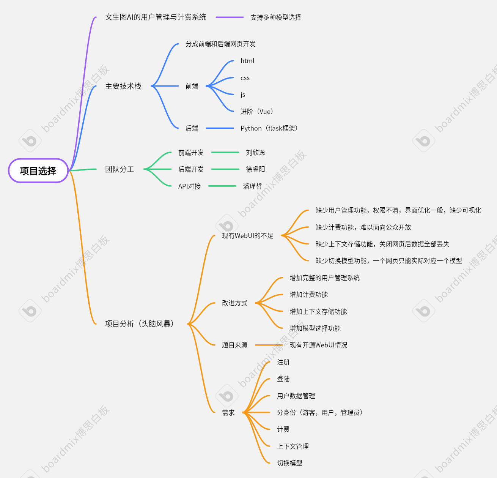

# 软件工程定项第一次会议记录

 * **参会者**：刘欣逸，徐睿阳，廖依淼，潘瑾哲
 * **时间**：2024年9月29号周日 东11舍

## 项目选择

文生图AI的用户管理与计费系统，支持多种模型选择

### 1. 主要技术栈
**分成前端和后端网页开发**

**前端**：html，css，js，进阶（Vue）。

**后端**：Python（flask框架）。

### 2. 团队分工

**前端开发**：刘欣逸

**后端开发**：徐睿阳

**API对接**：潘瑾哲

## 项目分析（头脑风暴）

### 1. 现有WebUI的不足

>* 缺少用户管理功能，权限不清，界面优化一般，缺少可视化。
>* 缺少计费功能，难以面向公众开放。
>* 缺少上下文存储功能， 关闭网页后数据全部丢失。
>* 缺少切换模型功能，一个网页只能实际对应一个模型。

### 2. 改进方式

- [x] 增加完整的用户管理系统。

- [x] 增加计费功能。

- [x] 增加上下文存储功能。

- [x] 增加模型选择功能。

### 3. 题目来源

* 现有开源WebUI情况。

### 4. 需求

* 注册

* 登陆

* 用户数据管理

* 分身份（游客，用户，管理员）

* 计费

* 上下文管理

* 切换模型

## 思维导图

## 会议图片

