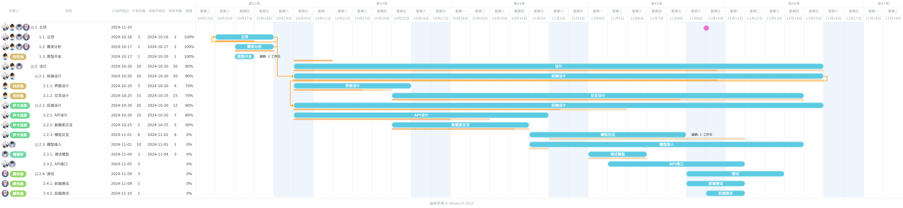

# 进度计划

## 设计

（全体）

+ 立项
+ 需求分析
+ 原型开发，确定系统架构
+ 任务分解，安排进度计划

## 开发

（全体）

**任务分解**

### 前端任务：

（刘欣逸）

#### 界面设计

（刘欣逸）

+ 登录界面设计
+ 用户主界面设计
+ 对话界面设计
+ 管理员界面设计

#### 交互设计

（刘欣逸）

+ 构建vue项目框架，与后端交互

+ 用户注册登录
+ 对话交互
+ 对话历史
+ 管理员后台数据管理
+ 页面跳转及特效

### 后端设计

（徐睿阳）

#### API设计

（徐睿阳）

1. 与前端交互

   + 构建Flask框架

   + 用户注册登录

   + 管理员鉴权

   + 余额充值

   + 返回对话内容

   + 管理员后台数据管理

2. 与后台数据库交互

   + 规定数据库交互接口

   + 用户登录注册

   + 记录对话历史

   + 记录用户余额

   + 管理员后台数据管理

3. 与模型交互

   + 将用户输入提供给模型，获得结果

#### 大数据分析和大模型接入

（潘瑾哲）

+ 调试不同模型
+ 提供API接口

## 测试

（廖依淼）

### 单元测试

+ 后端系统API单元测试
+ 前端组件单元测试

### 集成测试

+ 服务器部署
+ 服务器维护

## 发布

（全体）

# 甘特图

